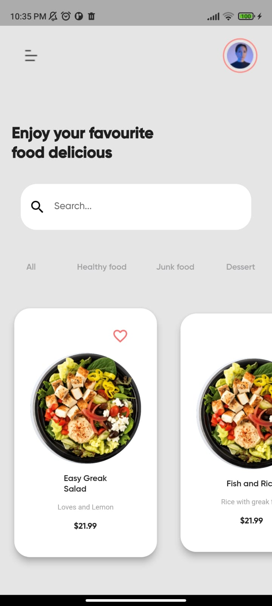

# App food Layout

- Desafio de layout proposto durante a disciplina de Programação IV - Com layout a partir do Dribble utilizando Dart e Flutter.

## Repositório 

- [Link do respositório](https://github.com/Brennez/food-app)

## Layout do Dribbble

- [Layout do dribbble](https://dribbble.com/shots/15794084-Food-Mobile-App?utm_source=Clipboard_Shot&utm_campaign=saberali&utm_content=Food%20Mobile%20App&utm_medium=Social_Share&utm_source=Clipboard_Shot&utm_campaign=saberali&utm_content=Food%20Mobile%20App&utm_medium=Social_Share)

## Tecnologias :octocat:

- Dart
- Flutter

## ScreenShots

| Home Page                              | Detalhes                                                    |
| -------------------------------------- | ----------------------------------------------------------- |
|       |              |
|                                        |                                                             |
| -------------------------------------- | ----------------------------------------------------------- |
|       |                                 |
